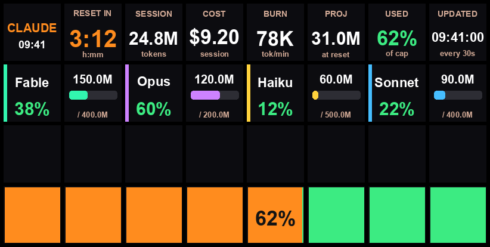

# Stream Deck Claude Usage Dashboard

A Python daemon that renders a live Claude Code usage dashboard across all 32 keys
of a **Stream Deck XL** (4x8). It refreshes every 30 seconds and shows:

- **Current session** (Claude's rolling 5-hour window): tokens used, estimated cost,
  burn rate, projected usage, and a big **countdown to reset**.
- **Weekly usage of every model** vs configurable limits, drawn as per-model
  percentage bars.
- A bottom-row **progress bar** of session usage that fills green to orange.



> The screenshot above uses sample data for illustration.

## How it works

Claude Code writes per-message usage to `~/.claude/projects/**/*.jsonl`. This tool
reads those logs directly (only recently-modified files/lines, so it stays fast),
computes the active 5-hour session block and trailing 7-day per-model totals, then
renders one image per key and pushes them to the device.

```
logs (~/.claude/projects) -> parser -> stats (session + weekly) -> layout -> Stream Deck
```

> Note: Anthropic's real weekly *limit* numbers and server-side reset times are not
> stored locally. Only your *usage* is. Limits are therefore read from `config.yaml`
> (set them to match your plan). The session reset countdown is derived from the
> 5-hour activity window.

## Requirements

- A Stream Deck XL (32 keys). Other models will work but the layout targets 32 keys.
- macOS/Linux with `hidapi` installed (needed by the `streamdeck` library).
- Python 3.10+.

## Setup

```bash
# 1. System dependency for USB HID access
brew install hidapi            # macOS
# sudo apt-get install libhidapi-libusb0   # Debian/Ubuntu

# 2. Python environment
python3 -m venv .venv
source .venv/bin/activate
pip install -r requirements.txt

# 3. Configuration
cp config.example.yaml config.yaml
#   edit config.yaml -> set weekly_token_limit per model to match your plan

# 4. Plug in the Stream Deck XL, then run
python -m src.main
```

Stop with `Ctrl-C`; the screen is cleared on exit.

## Usage

Run the tool as a module: `python -m src.main [options]` (activate the venv first
with `source .venv/bin/activate`). All modes accept `--config PATH` to point at a
specific config file (defaults to `config.yaml`, falling back to
`config.example.yaml`).

| Command | What it does | When to use |
| --- | --- | --- |
| `python -m src.main` | Runs forever, repainting every `refresh_seconds`. Clears the screen on `Ctrl-C`. | Interactive / leave it running in a terminal or as a service. |
| `python -m src.main --cron` | Renders one frame and exits, **leaving it on screen**. | Driving the deck from cron (see below). |
| `python -m src.main --once` | Renders one frame to the deck, then **clears** the screen and exits. | Quick one-off check on the device. |
| `python -m src.main --preview out.png` | Writes a composite PNG of all 32 keys. Needs no device or `hidapi`. | Previewing the layout / iterating on styling. |

Examples:

```bash
# See the dashboard without a Stream Deck attached
python -m src.main --preview preview.png && open preview.png

# Run continuously in the foreground
python -m src.main

# Use an alternate config
python -m src.main --config ~/my-deck.yaml
```

Exit codes: `0` success, `1` a refresh/render error, `2` no device / HID backend.

## Running via cron (instead of keeping it open)

The Stream Deck keeps displaying the last images after the process exits, so you
can repaint it periodically from cron instead of running a long-lived daemon. Use
`--cron`, which renders a single frame and leaves it on screen (no clear/dim on
exit). A wrapper script sets up the environment cron needs:

```bash
# Test the wrapper once
./run-cron.sh

# Edit your crontab
crontab -e
```

Cron's finest granularity is one minute. For a ~1 minute refresh:

```cron
* * * * * /path/to/stream-deck-agent/run-cron.sh >> /tmp/streamdeck.log 2>&1
```

For a ~30 second refresh, add a second line that sleeps 30s first:

```cron
* * * * * /path/to/stream-deck-agent/run-cron.sh >> /tmp/streamdeck.log 2>&1
* * * * * sleep 30; /path/to/stream-deck-agent/run-cron.sh >> /tmp/streamdeck.log 2>&1
```

Notes for cron on macOS:

- Quit the Elgato Stream Deck app first (only one program can own the device).
- Grant your cron runner (`/usr/sbin/cron`) **Full Disk Access** in System Settings
  → Privacy & Security if it can't read `~/.claude` or the USB device.
- Check `/tmp/streamdeck.log` if nothing appears.

## Configuration

See `config.example.yaml` for all options. Key ones:

- `refresh_seconds` — dashboard refresh interval (default 30).
- `brightness` — screen brightness 0-100.
- `models` — per-model `display_name`, `weekly_token_limit`, `color`, and optional
  `price` for cost estimation. Entries are matched by case-insensitive substring
  against the model id in the logs.
- `limit_metric` — `tokens` or `cost`, controls what the percentage bars represent.

## Layout (32 keys)

- **Row 0 (keys 0-7)** — session: title/clock, reset countdown, tokens, cost,
  burn rate, projected end usage, session %, status.
- **Rows 1-2 (keys 8-23)** — up to 8 model tiles (2 keys each): name + %, and a
  colored weekly usage bar with tokens vs limit.
- **Row 3 (keys 24-31)** — an 8-segment session usage bar (0-100%). Unused
  segments are green; used segments fill orange from the left (red on overflow),
  with the percentage shown on the current fill-front key.

## Troubleshooting

- **No Stream Deck found** — ensure it's plugged in and `hidapi` is installed. On
  Linux you may need a udev rule for non-root access.
- **All zeros** — confirm `claude_projects_dir` points at your Claude logs and that
  you've used Claude Code recently.
